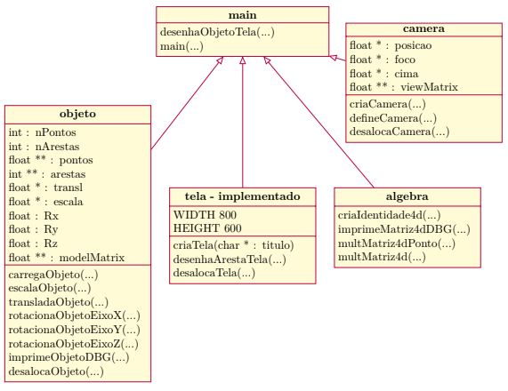

# Trabalho_Computacao_Grafica_2026-1
Implementações práticas e algoritmos desenvolvidos para a disciplina de Computação Gráfica (2026/1).

<div align="center">
  
</div>

## Como compilar e executar (Windows)

### 📋 Pré-requisitos

| Ferramenta | Observação |
|---|---|
| [MinGW](https://www.mingw-w64.org/) | Deve conter `gcc` e `mingw32-make` no PATH |
| [SDL2](https://github.com/libsdl-org/SDL/releases/tag/release-2.30.3) | Baixe o pacote `SDL2-2.30.3-mingw.zip` e instale manualmente |

> **Verificar se o `gcc` está disponível:**
> ```bash
> gcc --version
> mingw32-make --version
> ```
> Se algum comando não for reconhecido, adicione a pasta `bin/` do MinGW às variáveis de ambiente do sistema (ex.: `C:\MinGW\bin`).

---

### 1️⃣ Instalar a SDL2

Baixe o SDL2 para MinGW em: https://github.com/libsdl-org/SDL/releases/tag/release-2.30.3
(arquivo: `SDL2-2.30.3-mingw.zip`)

Extraia o zip e copie os arquivos do perfil `i686-w64-mingw32` para dentro da sua instalação do MinGW:

```bash
xcopy /E /Y "SDL2-2.30.3\i686-w64-mingw32\include\" "C:\MinGW\include\"
xcopy /E /Y "SDL2-2.30.3\i686-w64-mingw32\lib\"     "C:\MinGW\lib\"
```

> ⚠️ Ajuste `C:\MinGW\` para o caminho correto da **sua** instalação do MinGW.  
> O `SDL2.dll` (de `SDL2-2.30.3\i686-w64-mingw32\bin\SDL2.dll`) também precisa estar acessível — o Makefile já cuida de copiá-lo automaticamente para a raiz do projeto na compilação.

---

### 2️⃣ Compilar

#### Opção A — com `mingw32-make` (recomendado)

```bash
mingw32-make
```

O Makefile cuida de tudo automaticamente:
- Compila todos os `.c` da pasta `src/`
- Gera os objetos `.o` em `obj/`
- Linka com SDL2 e gera o `main.exe`
- Copia o `SDL2.dll` para a raiz do projeto

#### Opção B — com `gcc` direto (PowerShell ou Git Bash)

Se não tiver o `mingw32-make`, use no **PowerShell** ou **Git Bash** (⚠️ o glob `src/*.c` **não funciona no CMD padrão**):

```bash
gcc -Iinclude -Wall -std=c99 src/*.c -o main.exe -lmingw32 -lSDL2main -lSDL2 -lm
```

E copie o `SDL2.dll` manualmente para a raiz do projeto (o caminho abaixo depende de onde você extraiu o SDL2):

```bash
copy "C:\caminho\para\SDL2-2.30.3\i686-w64-mingw32\bin\SDL2.dll" .
```

> ℹ️ Resultado idêntico à Opção A, porém sem controle incremental — recompila tudo sempre.

---

### 3️⃣ Executar

```bash
.\main.exe
```

> O `SDL2.dll` precisa estar na mesma pasta que o `main.exe` (copiado automaticamente pelo Makefile na Opção A).

---

### 🧹 Limpar arquivos gerados

```bash
mingw32-make clean
```

Remove a pasta `obj/` e o `main.exe`.

---

Coloque os arquivos de objetos 3D em `data/` (ex.: `data/cubo.dcg`, `data/cubo2.dcg`).

---

## ⌨️ Controles da Aplicação

### 🌐 Geral (qualquer modo)

| Tecla | Ação |
|-------|------|
| `TAB` | Alterna entre **Modo Câmera** e **Modo Objeto** |
| `1`   | Seleciona o **Cubo 1** (amarelo, esquerda) |
| `2`   | Seleciona o **Cubo 2** (ciano, direita) |

---

### 📷 Modo Câmera

| Tecla | Ação |
|-------|------|
| `W`        | Mover câmera para **frente** (−Z) |
| `S`        | Mover câmera para **trás** (+Z) |
| `A`        | Mover câmera para **esquerda** (−X) |
| `D`        | Mover câmera para **direita** (+X) |
| `R`        | Mover câmera para **cima** (+Y) |
| `F`        | Mover câmera para **baixo** (−Y) |
| `←` / `→` | Orbitar câmera em torno do eixo Y |
| `↑` / `↓` | Orbitar câmera em torno do eixo X |

---

### 📦 Modo Objeto

| Tecla | Ação |
|-------|------|
| `W`        | Mover objeto para **frente** (−Z) |
| `S`        | Mover objeto para **trás** (+Z) |
| `A`        | Mover objeto para **esquerda** (−X) |
| `D`        | Mover objeto para **direita** (+X) |
| `R`        | Mover objeto para **cima** (+Y) |
| `F`        | Mover objeto para **baixo** (−Y) |
| `↑` / `↓` | Rotacionar em torno do eixo X |
| `←` / `→` | Rotacionar em torno do eixo Y |
| `Q`        | **Diminuir** escala (−10%) |
| `E`        | **Aumentar** escala (+10%) |

> O título da janela sempre exibe o modo atual e o objeto selecionado.